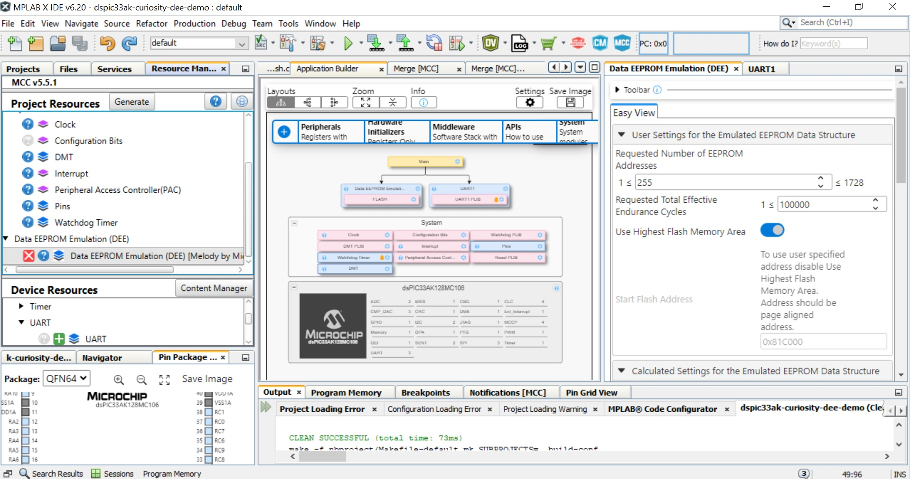

## dsPIC33A Curiosity Data EEPROM Emulation Demos

## Summary

Microchip Technology Inc., has expanded its product portfolio to include a wide variety of cost-effective PIC® Microcontrollers (MCUs) without an internal data EEPROM.

Many applications store nonvolatile information in the Flash program memory using table read and write operations. Applications that need to frequently update these data may have greater endurance requirements
than the specified Flash endurance for the MCU/Digital Signal Controller (DSC) devices.

The alternate solution of using an external, serial EEPROM device may not be appropriate for cost-sensitive or pin-constrained applications.

This Data EEPROM Emulation library presents a third alternative that addresses these issues. This library features an interface similar to an internal data EEPROM, which
uses available program memory and can improve endurance by a factor as high as 500.

This repository contains code examples which demonstrates DEE functionality in single and dual panel devices.

## Related Documentation
Please refer the readme of individual code examples for the more details.

## Accessing Data EEPROM Emulation Library

| Device Family         | Procedure                  |
| -----------           | -----------                |
| Devices supported on Melody| 1. Create project   2. Launch MCC   3. "Data EEPROM Emulation Library "will be available under "Libraries", if not available use content manager to download it.           |
