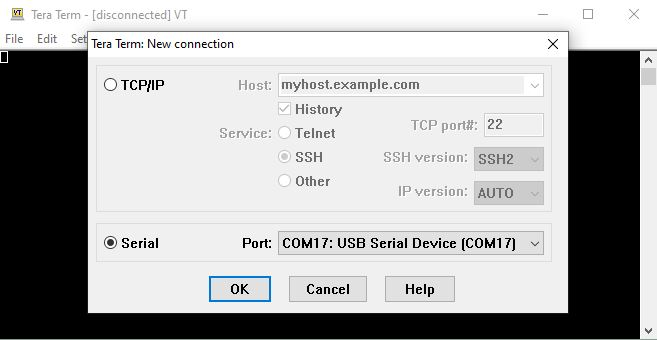

## dsPIC33A Curiosity Data EEPROM Emulation Demo(Single partition)

## Summary

Microchip Technology Inc., has expanded its product portfolio to include a wide variety of cost-effective PIC® Microcontrollers (MCUs) without an internal data EEPROM.

Many applications store nonvolatile information in the Flash program memory using table read and write operations. Applications that need to frequently update these data may have greater endurance requirements
than the specified Flash endurance for the MCU/Digital Signal Controller (DSC) devices.

The alternate solution of using an external, serial EEPROM device may not be appropriate for cost-sensitive or pin-constrained applications.

This Data EEPROM Emulation library presents a third alternative that addresses these issues. This library features an interface similar to an internal data EEPROM, which
uses available program memory and can improve endurance by a factor as high as 500.

This code example demonstrates the usage of Data EEPROM Emulation Library in a signle panel device.

## Related Documentation

- dsPIC33AK128MC106 microcontroller (https://www.microchip.com/dsPIC33AK128MC106)
- Emulating Data EEPROM for PIC18 and PIC24 MCUs and dsPIC33 DSCs (https://www.microchip.com/en-us/software-library/dspic33-pic24-data-eeprom-emulation)

## Software Used

- MPLAB® X IDE v6.25 or newer (https://www.microchip.com/mplabx)
- MPLAB® XCDSC v3.31 or newer (https://www.microchip.com/xc)
- Any of the serial terminal application. Example: Tera Term (https://ttssh2.osdn.jp/index.html.en)

## Hardware Used

- dsPIC33AK Curiosity Development Board (https://www.microchip.com/EV74H48A)
- dsPIC33AK128MC106 GP DIM (https://www.microchip.com/ev02g02a)
- USB Type-c Cable

### Terminal Setup (Tera Term)
1. Launch Tera Term
2. Go to File -> New Connection.
3. Select the "Serial" option and select the correct COM Port from the dropdown menu.

    

4. Go to Setup -> Serial port and ensure that the settings match the following:

    

## Operation
This demo runs the Data EEPROM Emulation , if emulation is successful then prints the message as shown below

If emulation fails then prints the message as shown below.

## Accessing Data EEPROM Emulation Library

| Device Family         | Procedure                  |
| -----------           | -----------                |
| Devices supported on Melody| 1. Create project   2. Launch MCC   3. "Data EEPROM Emulation Library "will be available under "Libraries", if not available use content manager to download it.           |
